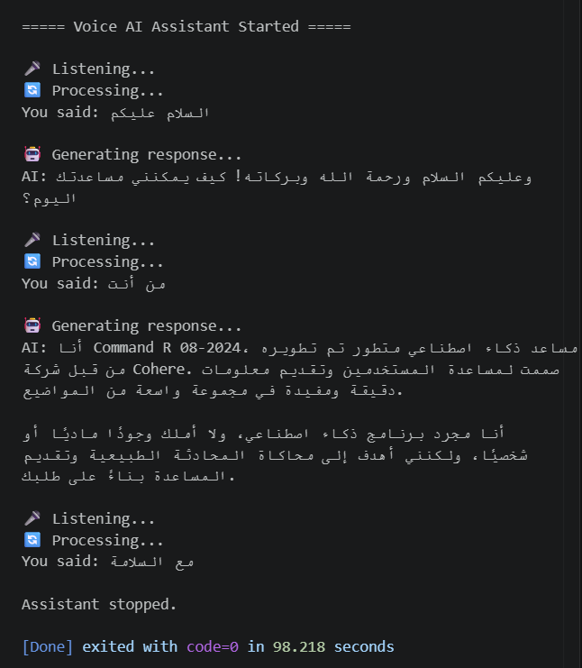

# Voice AI Assistant

A Voice-to-Voice AI Assistant that enables users to interact with an AI model using voice input.  
The system converts speech into text, processes the request using a Large Language Model (LLM), and converts the generated response back into speech.

---

## Project Overview

This project implements a complete voice interaction pipeline consisting of three main stages:

1. **Speech-to-Text (STT)**  
   Converts user voice input into written text using OpenAI Whisper.

2. **LLM Processing**  
   Sends the converted text to Cohere Large Language Model to generate an intelligent response.

3. **Text-to-Speech (TTS)**  
   Converts the generated AI response into audio using Google Text-to-Speech.

---

## Features

- Voice input through microphone
- Speech recognition using OpenAI Whisper
- AI response generation using Cohere API
- Text-to-Speech response output
- Arabic language support
- Continuous voice interaction
- Voice commands to stop the assistant

---

## Demo

Example of the assistant receiving voice input and generating an AI response:



---

## Technologies Used

- Python
- OpenAI Whisper
- Cohere API Key
- SpeechRecognition
- Google Text-to-Speech (gTTS)
- Pygame
- Python-dotenv

---


---

## Installation and Setup

### 1. Clone the repository

```bash
git clone https://github.com/your-username/voice-ai-assistant.git 
```

### 2. Install Dependencies
Install the required Python libraries:

```bash
pip install -r requirements.txt
```

### 3.Install FFmpeg
Whisper requires FFmpeg for audio processing.

Install FFmpeg on your system and restart your computer after installation.

### 4. Configure API Key

Create a file named:

.env

inside the project folder.

Add your Cohere API key:

COHERE_API_KEY=your_api_key_here
Running the Application


Start the assistant using:

python main.py


##The assistant can be stopped using:

خروج
انهاء
توقف
stop
exit
bye

##The project requires:

Python 3.x
Microphone access
Internet connection for API requests
Cohere API Key
Future Improvements
